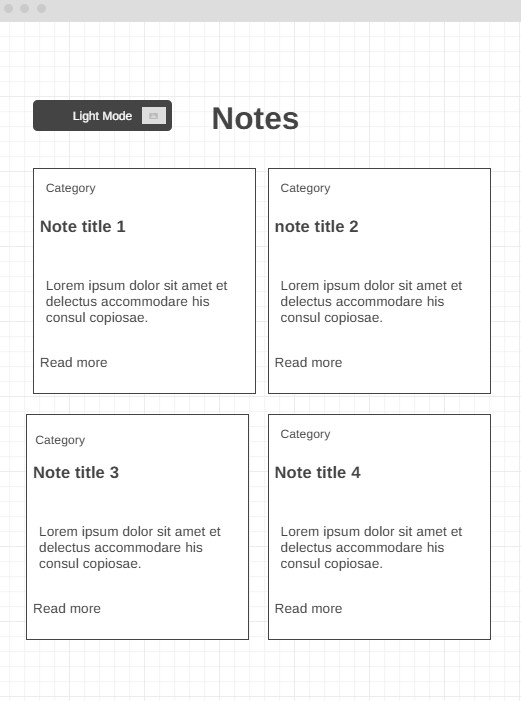
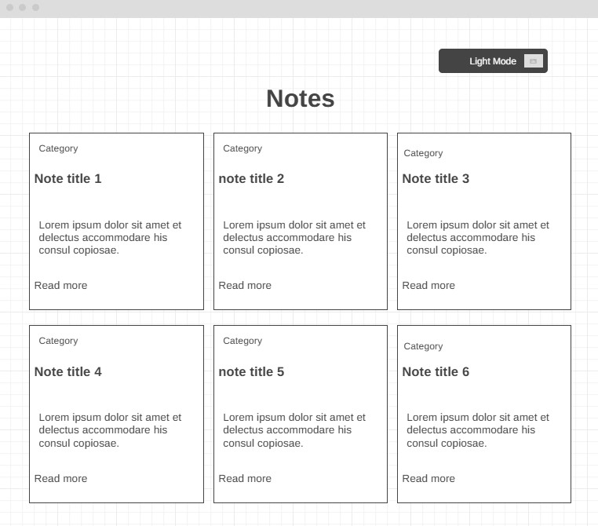

# WDD231-team
This is to make a Notes cite to keep track of Notes.
## Visual map
 {width=100px}

 {width=100px}
 {width=100px}

Project Proposal 
Logan MacConnell – Cesar Tavarez

Project Title: Notes
Target Audience: 
Our web application will be most useful for those in high school, college, and corporations to allow for easy note taking and retrieval of data. 
Features and Functionalities: 
-	Users will be able to organize their notes into different “folders.” Each of these folders will be nameable. 
-	Write and save notes within the different folders. 
-	Notes will be displayed by order of last edited. 
-	Users will be able to create and edit a mostly unlimited number of notes. 
-	Everything will be saved by using local storage as proof of concept. 
-	(IDEA) Allow the user to change the color of each note.
How will our project fulfill the requirements: 
-	We will employ the use of a detailed form to allow users to insert a title, date, category, and their specific note which can then be submitted, saved, and viewed.
-	In Local Storage, we will save objects which contain the data inputted by the user. Each note will be given a specific and auto-incremented ID to allow for our program to easily retrieve the data
-	For data, we will not need an external API but rather have a JSON file which is written by the code itself and automatically populated as the user uses our program. 
-	We will use a modal which allows users to create their notes. Upon clicking the “create” button, a model will appear which dims the background and presents the user with a form allowing them to create their note. 
-	We plan to use CSS animations to allow for a “light” or “dark” theme button which is animated. We may also investigate using an animation when a note folder is opened by the user. 

